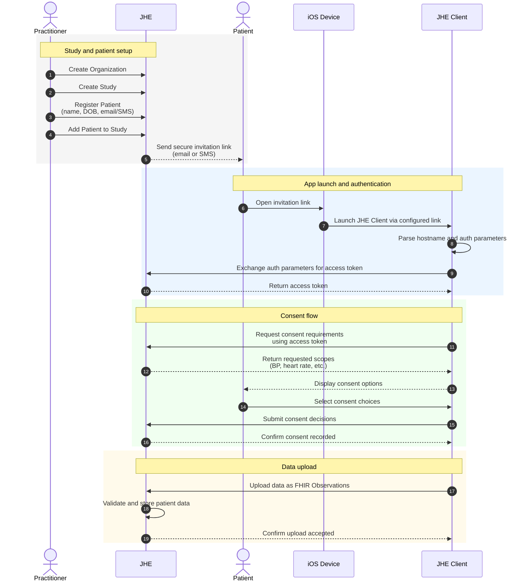

## Overview

The practitioner uses JHE to create the organization and study, register the patient, and send a secure invitation link.

When the patient opens the link on their iOS device, it launches the JHE Client via a configured link. The client extracts authentication parameters and exchanges them with JHE for an access token.

Using that token, the JHE Client retrieves the required consent scopes and presents them to the patient. The patient selects their consent preferences, which are recorded in JHE.

After consent is captured, the JHE Client uploads the patient’s health data as FHIR Observations. JHE validates, associates, and stores the data for the study.

